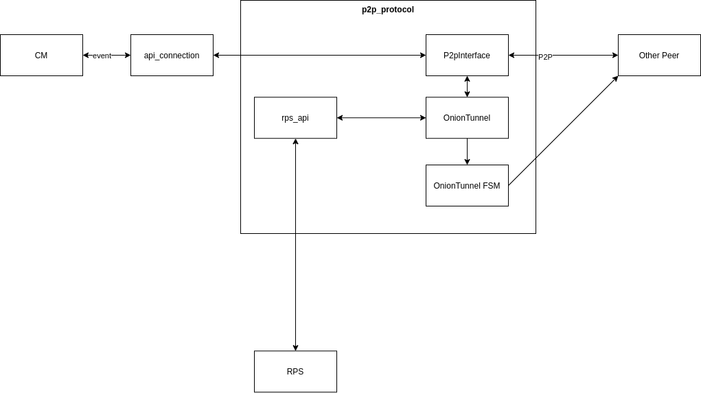

# Midterm Report for Onion Module of Team 10

## Changes to our assumptions in the initial report

## Module Architecture
- logical structures (classes, ...)
- process architecture,  threading, multi-process,...)
- networking
- security

### Logical Structure

We have split our architecture into three modules *API*, *TunnelMananger* and *P2P*.

**api_connection:** API is responsible for handling incoming requests from CM Module, deserializing them and handing them over to the p2p_protocol. API also accepts outgoing requests from the p2p_protocol, serializes them and sends them via TCP to CM.

**P2pInterface:** It contains the state of all tunnels. The P2pInterface decides how to proceed with an incoming CM requests. It is the request worker handling incomming requests from the other peers. Messages and requests are forwarded to the appropriate OnionTunnel.

**OnionTunnel:** This component builds new tunnel routes with rps_api and new FSM. Incomming events are then forwarded to the FSM.

**MessageCodec:** The MessageCodec module is responsible for deserializing/serializing and encrypting/decrypting of incoming and outgoing messages.

## Peer-to-Peer protocol
- message formats
- message explanation
- exception handling

## Future Work

## Workload Distribution

## Effort
