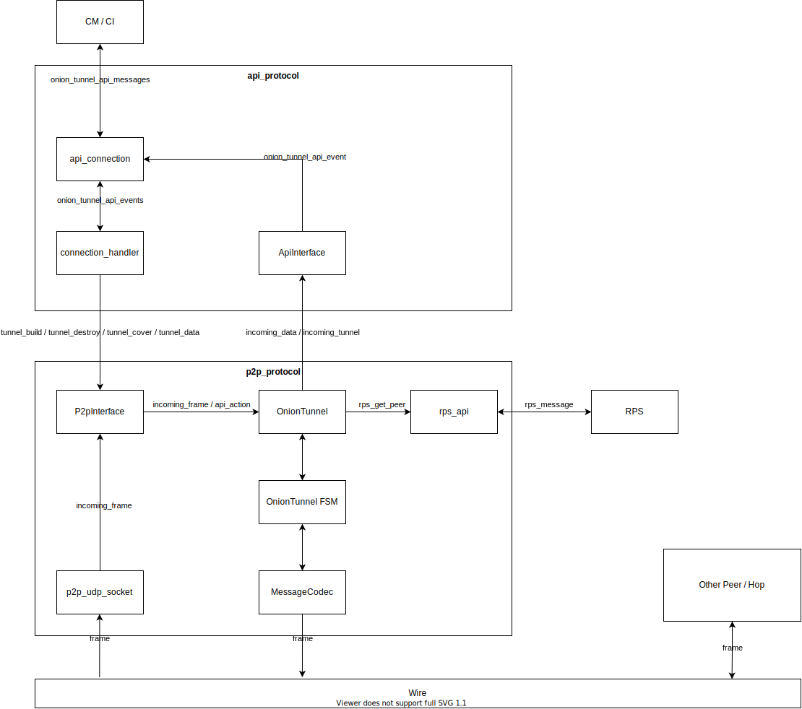

# Midterm Report for Onion Module of Team 10

## Changes to our assumptions in the initial report
- GitLab hooks not in use
- Additional libraries: async-trait and rand
- The schedule was mostly adhered to

## Module Architecture

In the following, the architecture of the onion module is described. The module is implemented
as a fully asynchronous library using the tokio async runtime. The binary makes use of this library.



### Binary

The binary in *onion_bin/main.rs* handles the command-line argument parsing
and makes then use of the onion_lib to run a peer, using the given ini-config path.

### Library

The onion_lib/lib.rs provides a function to run a peer, given an INI config file path:

```rust
pub fn run_peer<P: AsRef<Path> + Debug>(config_file: P) {}
```

First, the function parses the config_file. Afterwards, it creates a tokio runtime, which is used
for starting a p2p_interface and an api_interface asynchronously. It is then blocked on a conditional variable
and waits until one of the interfaces terminate to shutdown the whole peer.

The two interfaces, which are owned by the run_peer function, are referenced to each other using weak references that do not imply
ownership. These weak references can be upgraded at any time the peer is still active
and can then be used for communicating with each other. For example, API requests are parsed
in the api_protocol and are then passed to the p2p_protocol via the p2p_interface, while incoming tunnels
are handled in the p2p_protocol and passed to the API via the api_interface.

### Config Parser

The onion config parser parses the INI config file at the given path to
an OnionConfiguration struct using the rust-ini crate.

````rust
pub struct OnionConfiguration {
    pub p2p_port: u16,
    pub p2p_hostname: String,
    pub crypto_config: Arc<HandshakeCryptoConfig>,    // contains local host-key pair
    pub hop_count: u8,
    pub onion_api_address: SocketAddr,
    pub rps_api_address: SocketAddr,
    pub round_time: Duration,
    pub handshake_message_timeout: Duration,    // configurable handshake timeout per message
}
````

### API Protocol Package

The api_protocol structure is as follows:
```rust
api_protocol
    |--> api_connection
    |--> event    // incoming and outgoing events, inclusive serialization and deserialization 
    |--> messages // contains all the API messages, as well as serialization and deserialization methods.
    |--> mod.rs   // the API_interface and all the handlers and main logic
```

The API protocol is started by the run_peer function from the lib.rs
asynchronously, by calling the listen function on the api_interface.

```rust
pub(crate) struct ApiInterface {
    pub connections: Arc<Mutex<HashMap<ConnectionId, Connection>>>,
}

impl ApiInterface {
    pub async fn listen(
    & self,
    api_address: SocketAddr,
    p2p_interface: Weak<P2pInterface>,  // weak reference to p2p interface
    ) -> anyhow::Result < () > {}
}
```

This method binds the TCP API listener to the api_address and then listens
for new connections from the CM/CI layer. For each new request, a new api_connection
is created and handled using a connection handler. This handler first registers the
new connection at the self.connections hashmap and then handles new
incoming events from the CM/CI. This event_handler might return an outgoing event, which must be send
back to the API via the api_connection and is the response on the request or an incoming tunnel.
When the connection has been closed, the handler unregisters the connection from the hashmap and returns.

Simply put, the connection abstracts the TCP stream to an api_connection that can be used
for reading incoming events and writing outgoing events. The api_connection is responsible for
serializing and deserializing the events into the specified message formats (as bytes).
The serializing, deserializing and the message formats are in the messages module.

An incoming event is one of the following, which is parsed from the raw bytes as specified in the project documentation.
```rust
pub(crate) enum IncomingEvent {
    TunnelBuild(Box<OnionTunnelBuild>),
    TunnelDestroy(OnionTunnelDestroy),
    TunnelData(Box<OnionTunnelData>),
    Cover(OnionCover),
}
```

An outgoing event is one of the following, which is then passed to raw bytes and send back to the CM/CI.
````rust
#[derive(Debug)]
pub(crate) enum OutgoingEvent {
    TunnelReady(Box<OnionTunnelReady>),
    TunnelIncoming(OnionTunnelIncoming),
    TunnelData(Box<OnionTunnelData>),
    Error(OnionError),
}
````

### P2P Protocol Package

The p2p_protocol structure is as follows:
```rust
p2p_protocol
    |--> messages   // contains the protobuf file
    |--> onion_tunnel // onion tunnels, state machine and message codec
    |--> rps_api    // provides function for getting a random peer from rps
    |--> mod.rs     // P2P_interface inclusive udp listener
```

Similar to the API protocol, the P2P protocol is started by the run_peer function in the lib.rs by calling the listen function of the p2p_interface.

```rust
pub(crate) struct P2pInterface {
    onion_tunnels: Arc<Mutex<HashMap<TunnelId, OnionTunnel>>>, // Maps a tunnel id to a tunnel instance
    frame_ids: Arc<Mutex<HashMap<FrameId, (TunnelId, Direction)>>>, // Maps a network frame id to a tunnel id
    socket: Arc<UdpSocket>,
    config: OnionConfiguration,
    api_interface: Weak<ApiInterface>,
}
```

Only a single instance of this struct is created during the program runtime. Analogous to the api_protocol,
this instance is shared with the api_protocol by a weak reference. To create or destroy tunnels, to send data via
a tunnel or to create cover traffic the api_protocol can call the appropriate functions of the P2pInterface struct.

The listen function is listening on the udp socket. This socket is used for the p2p tunnel communication. Incoming
frames are parsed using protobuf messages (see message format below) and are mapped with frame_ids to the internal
tunnel_id. The tunnel_id is then mapped with onion_tunnels to the
according tunnel instance. This tunnel instances are defined in the onion_tunnel module. It contains abstractions
representing a single p2p tunnel connection. In the onion_tunnel, incoming frames or commands
from the API protocol are packed into events and are forwarded to the FSM (see Main FSM below).

#### Peer-to-Peer Protocol Design

The protocol is based on the security requirement discussion in [Protocol-Design](Protocol-Design.md). In the following,
the protocol is shown and described for connection from an initiator Alice via an intermediate hop H to
the target Bob:


In the beginning, all, Alice, Hop and Bob have a RSA identity key pair. Further, Alice knows the public key of 
Bob, since he is the callee recipient, and the public key of Hop (from RPS).

**Step 1: ClientHello from Alice to Hop**

Alice starts with choosing an elliptic curve *E* and a generator point *G*. She then selects a private ECDHE
parameter *a* and calculate her public parameter *aG*. Then she sends the *ClientHello = {E, G, aG}* to Hop.
The ClientHello must not contain any integrity or authenticity protection, since Alice must not leak her identity to Hop. 
Further, no replay protection is necessary since the ECDHE parameters are fresh already. !!! Aber wir haben noch die Challenge

**Step 2: ServerHello from Hop to Alice**

The Hop receives the ClientHello from Alice and uses the provided curve and generator point to generate his own ECDHE 
parameter pair *<h, hG>*. He then calculates the shared secret via the ECDHE *s = haG* and derives in total 2 MAC and ENC keys,
one per direction (from Alice to Hop and from Hop to Alice, similar how TLS is doing, to have an additional protection in 
one direction if the other direction's key is leaked). Since the Hop does not know yet, whether he is an intermediate hop or
the target, he acts as he is the target. Therefore, he creates a challenge for a Challenge-Response, which
is used for authentication of Alice to the target. He then signs his public ECDHE parameter, the challenge and the ClientHello
(in exactly this order for replay protection) using his private RSA identity key. Similar to the STS protocol, the signature is
encrypted by the encryption key from Hop to Alice, to avoid that eavesdropper, who know the public key of the Hop, could
verify the signature and leak the identity of the Hop. (This might not be that important in case of the Hop, but later the same
procedure is done for the target Bob, where the identity should definitely be hidden). Then, the ServerHello is sent back to Alice,
containing the public ECDHE parameter, the challenge and the signature. We don't need further replay protection here, since
the ECDHE parameter and the challenge is fresh already.

**Step 3: RoutingInformation from Alice to Hop**

Alice first calculates the shared secret and derives the same MAC and ENC keys as Hop. She then decrypts and verifies
the signature to ensure that the data has not been changed (integrity) and the data is actually from Hop (authenticity).
Then Alice creates the RoutingInformation, which will tell Hop that he should send the data to the address of Bob.
This information is encrypted to ensure nobody else than Hop knows the next hop and it is protected with a MAC to ensure
the integrity of the information. Encrypted data and MAC is then send to Hop. 
We don't need replay protection here, since the Hop only expects one RoutingInformation per session and the session keys,
especially the MAC verification, ensure that the handshake would fail when RoutingInformation
from an old session are sent here.

**Step 4: Processing RoutingInformation at Hop**

The hop first verifies the MAC and then decrypts the routing information, which tells him that he is an intermediate hop
and all the data should be transmitted to the peer at Bob's address.

**Step 5: ClientHello from Alice to Bob**

Alice then uses the same generator element and elliptic curve to create a new ECDHE parameter pair <a2, a2G>, similar to 
Step 1. She then encrypts the ClientHello for Bob, using the ENC key from Alice to Hop (or when there are multiple hops, one enc per hop).
This encrypted ClientHello will then be send to Hop.
Again, no replay protection is required here, since the ECDHE parameters are fresh. Further, no integrity protection
between Alice and the Hop is necessary, we only provide integrity protection from end-to-end (Alice-to-Bob). If the
ClientHello would have been modified, the handshake would fail.

**Step 6: Hop delegates data to Bob**

Hop then receives the encrypted ClientHello, decrypts it using his ENC key with Alice and sends the data
to Bob.

**Step 7: ServerHello from Bob to Alice**

This step is exactly the same as Step 2, where the Hop is replaced by Bob and the ServerHello is send
back to the Hop (source address of the ClientHello).

**Step 8: Hop delegates data to Alice**

Hop then receives the plain ServerHello, encrypts it using his ENC key with Alice and sends the data
to Alice.

**Step 9: RoutingInformation from Alice to Bob**

Very similar to Step 3 with some additional steps: First of all, the ServerHello is encrypted by the tunnel hops, thus
the data first have to be decrypted using the ENC keys with the hops. Since Bob is the target,
the challenge of Bob has to be answered by signing the challenge using the private RSA identity key from Alice.
This is done for proving authenticity from Alice to Bob. The signature and the public identity key are then
packed into the RoutingInformation packet, which is encrypted end-to-end using the ENC key to Bob. Further the MAC is 
calculated. Then the encrypted data and the MAC is tunneled via the hops.

**Step 10: Hop delegates encrypted RoutingInformation to Bob**

Hop then receives the double encrypted RoutingInformation, decrypts it using his ENC key with Alice and sends the data
to Bob.

**Step 11: Processing RoutingInformation at Bob** 

Similar to Step 4, but now Bob is the target, so he will verify the challenge response. On success, the connection
is established and ready for application data.

**Step 12: Application Data between Alice and Bob**

We obviously need confidentiality by end-to-end encryption, anonymity by tunneling, integrity by MACs on the 
encrypted application data between Alice and Bob and replay protection. Authenticity is already ensured due to the 
handshake design. This is where some additional challenges come in. First of all, we need any kind of nonce or timestamp
within the data to ensure replay protection. Further, the MAC must not be trackable through the tunnel, to keep the anonymity.
For this, the MAC has also been encrypted by each hop, such that it will change after each hop.
Another challenge is the IV, which also must not be trackable. Since the packet length must be preserved by each hop
and the padding length is a confidential information which has to be encrypted between the two ends, we cannot simply 
add multiple IVs to a packet, one per hop. Pre-shared IVs are also not an option, due to the statelessness of UDP 
(We cannot say which IV is used for the next incoming package when we ensure that the IV is changed for each message).
ECB mode is also not an option since otherwise, patterns in messages can be tracked over multiple hops.

Due to the injectivity of symmetric encryption mechanisms (e.g. AES) there is a quite elegant solution for this problem:
When Alice (or Bob) chooses a fresh IV, this IV can simply be encrypted by the encryption key
and will form another fresh IV (injectivity: enc(iv1) == enc(iv2) ==> iv1 == iv2). Therefore, we can simply
encrypt the single-block 16-byte IV via ECB (without padding) per hop. So when Alice creates an IV iv, then the message
to Bob can be encrypted using this iv. Afterwards, the iv is encrypted by the same encryption key using ECB. This new iv
is then used for the next hop and so on.

#### Peer-to-Peer Protocol Implementation

First of all, it should be noted, that the implementation of the actual protocol design varies a bit from the formal
design. Instead of exchanging a dynamic elliptic curve, we have fixed the curve to SECP256K1 for now.
Further, instead of calculating the parameters of ECDHE by our own, we use the openssl interface, which
creates a public EC keypair and derives a shared secret from the public key from the one peer and the private key from 
the other peer. Moreover, we use AEAD encryption via AES-GCM, therefore we don't derive MAC keys and we don't calculate
MACs, since the data is already authenticated. Thus, we only derive two encryption keys from the shared secret. Since we 
use aes-128, which requires 16 byte keys, our KDF is the sha256(shared_secret), which is then split into the two encryption
keys.
Furthermore, since the application layer does not support client authentication yet, we don't send the
public identity key from Alice to Bob at the moment and the challenge_response is not verified at the moment.


The p2p protocol is designed as a finite state machine (FSM), consisting of two components:
The Handshake FSM and the Main FSM. Using a FSM eliminates unexpected / unhandled cases, since for every state
it is clearly defined how to react on every event. The communication with the FSM, as well as the communication
between the Main and the Handshake FSM is done via mpsc_channels to ensure LIFO ordering and
synchronization. The FSMs run asynchronously via tokio.

#### Main FSM


The main FSM consists of four different states:
- **Closed** is the initial state on creation. It only expects an **INIT** event, which triggers
an init_action and then goes into the **Connecting** state on success. Each other event leads to termination.


- **Connecting** is the state where the handshake is active. When receiving the Handshake_Result_Success event, the
FSM goes into the state **Connected**. When receiving incoming frames that can be successfully parsed to handshake data, 
  this is passed to the handshake FSM and the FSM stays in **Connecting**. On close event, receiving closure, handshake errors, unexpected events and 
  parsing error, the FSM terminates. 
  

- **Connected** is the state, where the tunnel is established and communication (sending and receiving app data) is 
  allowed. On close, received_close, sending errors, incoming_frame parsing errors or unexpected events, the
  FSM terminates.
  

- **Terminated** is the final state, which has no outgoing transitions.


Since the initiator of the tunnel and the target (hop or real target) have completely different
init actions, the FSM is implemented as a trait with default implementations for the shared functionality, while the
peer-specific functions are implemented by the InitiatorFsm and the TargetFsm.
The main difference is the implementation of the *action_init* function. The target FSM simply creates
the HandshakeFsm, runs it, and builds the communication channel between Main FSM and Handshake FSM. In contrast, the
InitiatorFsm loops over all hops and the target peer and stays in the state **Connecting** until the whole tunnel
is established. For this, the handshake result for each handshake with a peer is hooked and caught and new
Handshake FSMs are created sequentially for each next hop. The underlying communication layer (MessageCodec)
is updated after each successful handshake to an intermediate hop, such that the data to the next hop are tunneled
through the partially established tunnels.

#### Handshake FSM


The handshake FSM is used for both, client and server peer. It is distinguished by the different init state:
Handshake FSMs on clients starts in the *Start* state, while the server side starts in the *WaitForClientHello* state.
The FSM consists of six different states:

- **Start** is the init state for the client side. It only expects the *INIT* event, which triggers the ClientHello
  creation and forwarding to the server. On sending error, the handshake FSM goes into the *Error* state, on succes into
  the *WaitForServerHello* state.
  
  
- **WaitForClientHello** is the init state for the server side. It only expects the ClientHello. It processes the ClientHello
  and creates the ServerHello accordingly the P2P handshake protocol. It then sends the ServerHello back to the client.
  On any error (signing error, sending error, key exchange error), the handshake FSM terminates in the *Error* state, otherwise
  it goes into *WaitForRoutingInformation*.
  

- **WaitForServerHello** only expects the ServerHello. It processes the ServerHello and creates the encrypted RoutingInformation
  accordingly the P2P handshake protocol. On any error (key exchange error, signature error, sending error), the handshake FSM 
  goes into the *Error* state, otherwise the handshake on client side is complete and the FSM is terminated in the *Success*
  state.
  

- **WaitForRoutingInformation** only expects the encrypted RoutingInformation. It decrypts and processes the
RoutingInformation accordingly the P2P handshake protocol and marks the tunnel either as target or as
  intermediate hop. On any error (signature error, parsing error), the handshake FSM
  goes into the *Error* state, otherwise the handshake on server side is complete and the FSM is terminated in the *Success*
  state.
  

- The **Error** state is more fictive. In the implementation, it means sending the *HANDSHAKE_RESULT_ERR* event
  to the main FSM and destroying the handshake FSM.
  

- The **Success** state is more fictive. In the implementation, it means sending the *HANDSHAKE_RESULT_OK* event
to the main FSM and destroying the handshake FSM.

If a non-final state receives a handshake timeout, a closure from the main FSM or an unexpected event, the handshake
FSM terminated by transiting into the *Error* state immediately.

### Message format
We use protobuf messages for the P2P protocol. 

```proto3
syntax = "proto3";

// P2P Onion Tunnel frame
message TunnelFrame {

  // an identifier for identifying the corresponding tunnel of this frame
  fixed64 frame_id = 1;

  // random, unpredictable iv used for encryption
  bytes iv = 2;

  oneof message {
    // auth_tag + [padding_size: u16, data_type: u8, data, padding] encrypted
    bytes data = 3;
    Close close = 4;
  }
}

message HandshakeData {
  // establish secure channel
  oneof message {
    ClientHello client_hello = 1;
    ServerHello server_hello = 2;
    RoutingInformation routing = 3;
  }
}

message ClientHello {
  // frameId used for communicating with the source
  uint64 backward_frame_id = 1;
  bytes ecdh_public_key = 2;
}

message ServerHello {
  // used for hops to tell next hop how to address prev hop
  uint64 backward_frame_id = 1;
  // used for telling the source how to address the peer
  uint64 forward_frame_id = 2;
  // public ECDHE parameter
  bytes ecdh_public_key = 3;
  // challenge for client authentication
  bytes challenge = 4;
  // iv for signature encryption
  bytes iv = 5;
  // encrypted signature
  bytes signature = 6;
}

message RoutingInformation {
  bool is_endpoint = 1;
  bytes next_hop_addr = 2;
  uint32 next_hop_port = 3;

  oneof optional_challenge_response {
    bytes challenge_response = 4;
  }
}

message ApplicationData {
  fixed32 sequence_number = 1;
  bytes data = 2;
}

message Close {}
```

#### Serialization / Deserialization

Each transfered frame between peers is a TunnelFrame message. The TunnelFrame is not encrypted,
because it contains the frame_id used in the p2p_protocol to map the frame to a onion_tunnel
and the IV used during encryption. The message field contains the actual data transfered with
by the frame. It can be a Close message (signals hops to close the tunnel) or binary data.

The binary data is always a (plaintext or encrypted) serialized representation of the
two other protobuf messages (HandshakeData,
ApplicationData).
It is always exactly 1024 bytes long and is structed as follows:

- The first 16 bytes are the auth_tag used for the AES-GCM
integrity and authorization verification.
- The next 2 bytes specify the padding_size appended at the end of the binary data that
the data has always the same length.
- The next byte specifies the data_type. This indicates the contained protobuf message type in the remaining bytes until the padding.

This serialization and deserialization is handled in RawData. If the message contains a
HandshakeData and this HandshakeData contains ClientHello or ServerHello, then the payload
cannot be encrypted at the tunnel initiator and target, because those are responsible for the key
exchange. In all other cases (ApplicationData or HandshakeData with RoutingInformation) the payload must be encrypted.

#### Encryption

For the encryption between each hop, we need an encryption with static length. Integrity
protection is not required between hops, because they do not interact with the data.
We chose AES-CTR for this use case.

For the encryption between the initiator and the target hop, we need an encryption with
static length, integrity protection and authentication. We chose AES-GCM for this, because
it meets all our requirements.

The encryption works as follows:

The initiator generates a random IV and encrypts the serialized payload
but skips the first 16 bytes (auth_tag) using AES-GCM. He then replaces the first
16 bytes with the auth_tag result from the encryption. For each hop between the
initiator and the target, the payload (including auth_tag) and the IV are then encrypted
once more with the shared key exchanged between the initiator and the hop.

Initiator:
- iv = random()
- cipher_payload_init = enc_ctr_h1(enc_ctr_h2(enc_gcm_target(iv, msg)))
- cipher_iv_init = enc_ecb_h1(enc_ecb_h2(enc_ecb_target(iv)))

Hop 1:
- cipher_iv_h1 = dec_ecb_iv_h1(cipher_iv_init)
- cipher_payload_h1 = dec_ctr_payload_h1(cipher_iv_h1, cipher_payload_init)

Hop 2:
- cipher_iv_h2 = dec_ecb_iv_h2(cipher_iv_h1)
- cipher_payload_h2 = dec_ctr_h2(cipher_iv_h2, cipher_h1)

Target:
- iv = dec_ecb_iv_target(cipher_iv_h2)
- msg = dec_gcm(iv, cipher_payload_h2)


### Exception Handling

The current state of exception handling is, that whenever an error occurs, the tunnel is
destroyed. Replay attacks, data/IV manipulation or packet loss during
the handshake cause the termination of the tunnel. Only packet loss in the Connected state
is ignored to match with the nature of an udp protocol.

Future work is planed to handle more errors where possible to reduce the attack surface
for simple DoS attacks and with that to improve the robustness of the protocol against other
network related issues.


## Future Work
- Add Rounds
- Add Cover traffic and Dummy traffic
- Improve closing procedure: Hop Teardown, Teardown of broken connections
- Add multiple frame IDs, which are then randomly chosen per packet
- Robustness
- Verify protection against timing and pattern attacks, break-node-and-see-which-connection-is-down
- Improving Test coverage (at the moment 82%)

## Workload Distribution

#### Leon
- Implementation of the API protocol
- Implementation of the ConfigParser
- Implementation RPS API
- Design and Implementation FSM, Handshake FSM
- Improvements in the p2p_protocol package
- Padding and packet fragmentation  
- Protocol Design (together)  
- Integration Tests

#### Florian
- Gitlab CI
- First Draft p2p_protocol implementation
- Dynamic tunnel identifier protocol
- Protocol Design (together)  
- Implementation crypto stuff
- Unit Tests

## Effort
Leon: 120 hours

Florian: 40 hours
